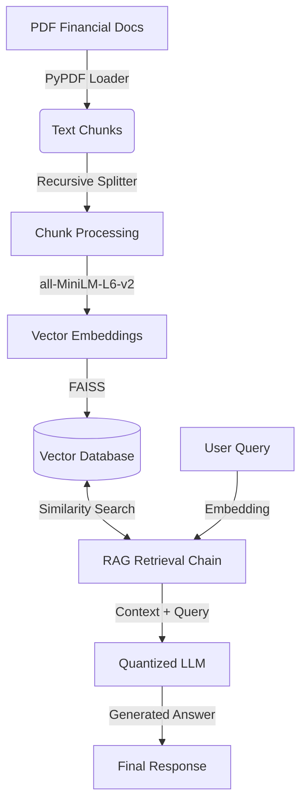

## 🎯 Project Overview

Financial analysts spend countless hours manually searching through dense 10-K reports and financial statements to find specific metrics. This manual process is slow, error-prone, and unscalable.
**The Goal:** Build an intelligent assistant that can instantly answer natural language questions about financial documents with citation-backed accuracy, running entirely on consumer-grade hardware to ensure data privacy.

## System Architecture



## Key Achievements

- **Built production-ready RAG pipeline** for financial document analysis using LangChain and FAISS, enabling users to query complex 10-K reports with high accuracy.

- **Optimized for consumer GPUs** (RTX 4050) using 4-bit quantization and efficient vector storage, reducing VRAM usage to under 6GB while maintaining model performance.

- **Developed dual-interface application** with high-performance FastAPI backend for API consumers and intuitive Streamlit frontend for interactive research.

## Technical Stack
- **Backend**: FastAPI with async support for high-throughput request handling
- **Frontend**: Streamlit for rapid prototyping and interactive visualization
- **Infrastructure**: CUDA-accelerated PyTorch environment

## Technical Implementation

### RAG Engine Core
```python
class RAGEngine:
    def _initialize(self):
        # Load embeddings on GPU
        device = "cuda" if torch.cuda.is_available() else "cpu"
        embeddings = SentenceTransformerEmbeddings(
            model_name="sentence-transformers/all-MiniLM-L6-v2",
            device=device
        )
        
        # Load Vector Store
        self.vector_store = FAISS.load_local(
            str(settings.vector_store_path),
            embeddings
        )
        
        # Initialize Quantized LLM
        # Logic to load model with 4-bit quantization...
```

### Performance Optimization
- **Caching**: Implemented intelligent caching for embeddings and model weights
- **Async Processing**: Leveraged Python's `asyncio` for non-blocking API endpoints
- **Memory Management**: Automatic device mapping and aggressive garbage collection

## Challenges & Learnings
- **GPU Memory Constraints**: Overcoming VRAM limitations by implementing 4-bit quantization and careful batch sizing.
- **Hallucination Reduction**: Tuned retrieval parameters (k=4) and prompt templates to strictly ground answers in retrieved context.
- **Document Parsing**: Handling complex PDF layouts and tables commonly found in financial reports.
