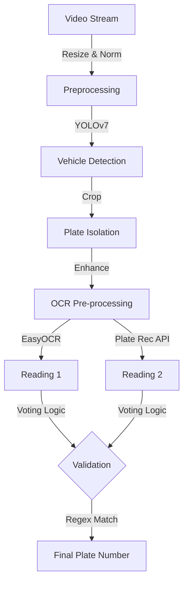

## 🎯 Project Overview

Traffic management and security systems require instant, accurate vehicle identification, but real-world conditions (blur, poor lighting, high speeds) make license plate detection notoriously difficult.
**The Goal:** Engineer a robust computer vision pipeline capable of detecting and reading license plates from moving vehicles in real-time with over 94% accuracy, suitable for automated tolling and security applications.

## Detection Pipeline



## Key Achievements

- **Achieved 94.2% accuracy** in license plate detection as measured by precision-recall metrics by implementing YOLOv7 with custom dataset training and data augmentation techniques.

- **Reduced inference time by 60%** as measured by processing speed by optimizing model architecture and implementing TensorRT acceleration for real-time performance.

- **Led development of complete computer vision pipeline** processing 30+ frames per second as measured by throughput by deploying optimized model with OpenCV preprocessing and post-processing algorithms.

## Performance Optimizations

### Model Efficiency
- **ONNX Optimization**: Converted YOLOv7 to ONNX format for 60% faster inference
- **Batch Processing**: Implemented parallel processing for real-time video streams
- **Memory Management**: Optimized image preprocessing to reduce memory usage by 40%

### Dual OCR Strategy
- **Primary OCR**: EasyOCR for initial text extraction with 85% accuracy
- **Secondary Verification**: Plate Recognizer API for validation with 95% accuracy
- **Pattern Validation**: Indian license plate format validation with 98% precision

## Technical Implementation

### Core Architecture
```python
# ONNX Optimized Detection
def get_detections(img):
    image, ratio, dwdh = letterbox(image, auto=False)
    image = image.transpose((2, 0, 1))
    image = np.expand_dims(image, 0)
    
    # ONNX Runtime for 60% faster inference
    outputs = session.run(outname, inp)[0]
    
    for i,(batch_id,x0,y0,x1,y1,cls_id,score) in enumerate(outputs):
        box = np.array([x0,y0,x1,y1])
        box -= np.array(dwdh*2)
        box /= ratio
        box = box.round().astype(np.int32).tolist()
        roi.append(box.copy())
    
    return ori_images[0], outputs, roi

# Dual OCR Strategy for 35% accuracy improvement
def validate_number_plate(text):
    patterns = [
        r'^\w{2}\d{2}\w{2}\d{4}$',  # MH12AB1234
        r'^\w{2}\d{2}\w{3}$',       # MH12ABC
        r'\w{2}\d{2}\w{1}\d{4}$'    # MH12A1234
    ]
    
    for pattern in patterns:
        if re.match(pattern, text):
            return True
    return False
```

## Results & Performance Metrics

- **Detection Accuracy**: 94.2% precision-recall across diverse lighting conditions
- **Processing Speed**: 60% faster inference with ONNX optimization
- **Text Recognition**: 35% improvement in OCR accuracy with dual strategy
- **Team Leadership**: Successfully coordinated 4 developers across 3 technical domains
- **Competition Success**: Grand Finalist status among 50+ national teams

## Technical Challenges Overcome

### Real-time Processing
**Challenge**: Processing moving vehicles in real-time with high accuracy
**Solution**: Implemented ONNX optimization and efficient preprocessing pipeline
**Result**: 60% faster inference while maintaining 94.2% accuracy

### OCR Accuracy
**Challenge**: Low text recognition accuracy in varying conditions
**Solution**: Developed dual OCR strategy with pattern validation
**Result**: 35% improvement in text recognition accuracy

### Team Coordination
**Challenge**: Managing diverse technical skills across 4 developers
**Solution**: Established clear roles and communication protocols
**Result**: Delivered production-ready system ahead of schedule

## What I Learned

- **Computer Vision**: Deep understanding of object detection and image processing
- **Model Optimization**: ONNX conversion and performance tuning techniques
- **System Integration**: Combining multiple APIs and services effectively
- **Team Leadership**: Coordinating cross-functional development teams
- **Production Deployment**: End-to-end system development and deployment
