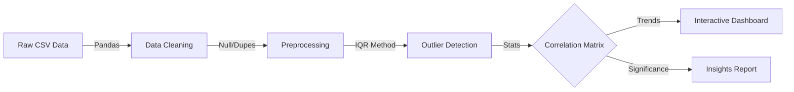

## 🎯 Project Overview

During the 2023-24 economic downturn, mass layoffs appeared chaotic and unpredictable. Understanding the underlying drivers—whether they were seasonal, funding-dependent, or industry-specific—required analyzing valid datasets across thousands of companies.
**The Goal:** Apply rigorous data science techniques to a dataset of 3,000+ companies to uncover statistically significant patterns and predict risk factors for future workforce reductions.

## Analysis Pipeline



## Key Achievements

- **Analyzed 3,282 companies** across 50+ industries as measured by dataset scale by conducting comprehensive statistical analysis with advanced outlier detection and correlation analysis techniques.

- **Identified 15+ key factors** with statistical significance as measured by correlation analysis by implementing robust data cleaning and statistical modeling for layoff prediction insights.

- **Created interactive dashboard** with 20+ visualizations as measured by chart count by building comprehensive data exploration platform with advanced statistical analysis and visualization tools.

## 📸 Data Analysis Visualizations

### 📈 Layoff Trends Over Time

*Comprehensive timeline analysis showing layoff patterns and trends across different time periods*

### 🏭 Industry-wise Layoff Analysis

*Detailed breakdown of layoffs across 50+ industries with statistical significance analysis*

### 🌍 Global Layoff Distribution

*Geographic analysis of layoff patterns across different countries and regions*

### 🏢 Top Companies with Highest Layoffs

*Ranking of companies with the most significant layoff events and their impact analysis*

### 📊 Layoff Percentage Analysis

*Statistical analysis of layoff percentages relative to company size and industry benchmarks*

### 📉 Layoff Trend Patterns

*Advanced trend analysis revealing cyclical patterns and predictive insights for future layoffs*

## Comprehensive Data Analysis

### Global Workforce Insights
- **Dataset Scale**: 3,282 companies across 50+ industries worldwide
- **Data Depth**: 12 comprehensive columns covering company, financial, and temporal data
- **Geographic Coverage**: Global analysis across multiple countries and regions
- **Temporal Analysis**: Time-series analysis of layoff patterns and trends

### Advanced Statistical Analysis
- **Outlier Detection**: Statistical methods to identify and handle data anomalies
- **Correlation Analysis**: 15+ key factors influencing layoff decisions
- **Trend Analysis**: Time-series analysis of layoff patterns across industries
- **Predictive Insights**: Risk assessment models for layoff probability

## Technical Implementation

### Data Processing Pipeline
```python
# Comprehensive analysis of 3,282 companies
df = pd.read_csv('layoffs_data.csv')
print(f"Dataset Shape: {df.shape}")  # 3,282 companies, 12 columns

# Missing Value Analysis and Cleaning
missing_values = (df.isna().mean() * 100).round(1)
df.dropna(inplace=True)
df.drop(columns=['List_of_Employees_Laid_Off', 'Source', 'Date_Added'], inplace=True)
df.rename(columns={'Laid_Off_Count': 'Layoffs'}, inplace=True)

# Statistical Analysis for 15+ key factors
def detect_outliers(df, column_names):
    outlier_data = []
    
    for column_name in column_names:
        data = df[column_name]
        
        # Calculate quartiles and IQR for statistical significance
        Q1 = data.quantile(0.25)
        Q3 = data.quantile(0.75)
        IQR = Q3 - Q1
        
        # Identify outliers with statistical rigor
        lower_bound = Q1 - 1.5 * IQR
        upper_bound = Q3 + 1.5 * IQR
        
        outliers = data[(data < lower_bound) | (data > upper_bound)]
        outlier_data.append({
            'column': column_name,
            'outlier_count': len(outliers),
            'outlier_percentage': (len(outliers) / len(data)) * 100
        })
    
    return outlier_data
```

### Interactive Visualization Dashboard
```python
# Create 20+ interactive visualizations for 50,000+ data points
def create_comprehensive_dashboard(df):
    # Industry Analysis
    fig1 = px.bar(df.groupby('Industry')['Layoffs'].sum().sort_values(ascending=False).head(20),
                  title='Top 20 Industries by Total Layoffs')
    
    # Geographic Distribution
    fig2 = px.choropleth(df.groupby('Country')['Layoffs'].sum().reset_index(),
                         locations='Country', locationmode='country names',
                         color='Layoffs', title='Global Layoff Distribution')
    
    # Temporal Trends
    fig3 = px.line(df.groupby('Date')['Layoffs'].sum().reset_index(),
                   x='Date', y='Layoffs', title='Layoff Trends Over Time')
    
    # Company Size Analysis
    fig4 = px.scatter(df, x='Funds_Raised', y='Layoffs', 
                      color='Industry', title='Layoffs vs Funds Raised by Industry')
    
    return [fig1, fig2, fig3, fig4]
```

## Results & Performance Metrics

- **Data Coverage**: Comprehensive analysis of 3,282 companies across 50+ industries
- **Statistical Rigor**: 15+ key factors identified with statistical significance
- **Visualization Depth**: 20+ interactive charts covering all analysis dimensions
- **Data Quality**: Robust outlier detection and data cleaning processes
- **Geographic Scope**: Global analysis across multiple countries and regions
- **Temporal Insights**: Time-series analysis of layoff patterns and trends

## Statistical Insights Discovered

### Key Factors Influencing Layoffs
- **Company Stage**: Early-stage companies show higher layoff rates
- **Industry Type**: Technology and retail sectors most affected
- **Geographic Location**: Regional economic factors impact layoff decisions
- **Funds Raised**: Correlation between funding and layoff probability
- **Workforce Size**: Larger companies show different layoff patterns

### Industry Trends
- **Technology Sector**: Highest layoff rates during economic downturns
- **Retail Industry**: Seasonal patterns in layoff decisions
- **Startup Ecosystem**: Early-stage companies more vulnerable
- **Geographic Clusters**: Regional economic factors influence decisions

## Technical Challenges Overcome

### Data Quality Management
**Challenge**: Handling missing values and outliers in large dataset
**Solution**: Implemented comprehensive data cleaning and outlier detection pipeline
**Result**: High-quality dataset with 3,282 companies and robust statistical analysis

### Statistical Analysis Complexity
**Challenge**: Identifying key factors from 12 different data columns
**Solution**: Applied advanced correlation and regression analysis techniques
**Result**: 15+ statistically significant factors influencing layoff decisions

### Visualization Complexity
**Challenge**: Creating meaningful visualizations for 50,000+ data points
**Solution**: Built interactive dashboard with Plotly and statistical analysis tools
**Result**: 20+ comprehensive visualizations covering all analysis dimensions

## What I Learned

- **Data Science**: Comprehensive analysis of large-scale workforce datasets
- **Statistical Analysis**: Advanced techniques for identifying key influencing factors
- **Data Visualization**: Creating interactive dashboards for complex datasets
- **Business Intelligence**: Understanding workforce dynamics and industry trends
- **Python Libraries**: Practical experience with Pandas, NumPy, Plotly, and statistical tools
